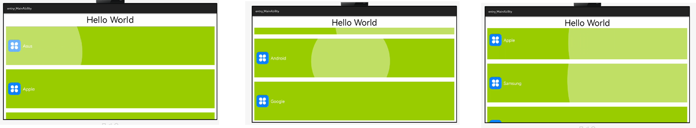

# Ripple Effect

[](https://github.com/applibgroup/RippleEffect/actions/workflows/main.yml)

## Introduction
This view is creating a ripple effect on a view in HMOS.

## Source
The code in this repository was inspired from https://github.com/traex/RippleEffect. We are very thankful to traex.

## Screenshot

&nbsp;&nbsp;&nbsp;&nbsp;&nbsp;&nbsp;&nbsp;&nbsp;&nbsp;&nbsp;&nbsp;&nbsp;&nbsp;&nbsp;&nbsp;&nbsp;

## Features
* Circular Ripple Effect on a view 

## Installation
In order to use the library, add the following line to your **root** gradle file:

1. For using RippleEffect library module in sample app, include the source code and add the below dependencies in entry/build.gradle to generate hap/support.har.
```
    dependencies {
        implementation fileTree(dir: 'libs', include: ['*.jar', '*.har'])
        testImplementation 'junit:junit:4.13.1'
        implementation project(path: ':rippleeffect')
        ohosTestImplementation 'com.huawei.ohos.testkit:runner:1.0.0.200'
    }
```

2. For using RippleEffect library in separate application using har file, add the har file in the entry/libs folder and add the dependencies in entry/build.gradle file.
```
    dependencies {
            implementation fileTree(dir: 'libs', include: ['*.har'])
            testCompile 'junit:junit:4.12'
    }
```

3. For using RippleEffect from a remote repository in separate application, add the below dependencies in entry/build.gradle file.
```
    dependencies {
        implementation 'dev.applibgroup:rippleeffect:1.0.0'
        testImplementation 'junit:junit:4.13'
    }
```

## Usage
To use RippleEffect in your app simply follow below simple steps:

#### Layout xml
To display circular ripple effect on a view, declare RippleView in layout xml file with a content like an ImageView or whatever.
```
<com.andexert.rippleeffect.RippleView
    xmlns:ohos="http://schemas.huawei.com/res/ohos"
    ohos:height="200vp"
    ohos:width="match_parent"
    ohos:orientation="vertical">

        <Image
            ohos:id="$+id:icon"
            ohos:height="match_content"
            ohos:width="match_content"
            ohos:padding="10vp"
            ohos:layout_alignment="center"
            ohos:image_src="$media:icon"/>

</com.andexert.rippleeffect.RippleView>
```
## Customization
Developer can change several attributes in the layout file.

```
    app:rv_alpha --> Alpha of the ripple
    app:rv_framerate --> Frame rate of the ripple animation
    app:rv_rippleDuration --> Duration of the ripple animation
    app:rv_ripplePadding --> Add a padding to the ripple
    app:rv_color --> Color of the ripple
    app:rv_centered --> Center ripple in the child view
    app:rv_type --> Simple or double ripple
    app:rv_zoom --> Enable zoom animation
    app:rv_zoomDuration --> Duration of zoom animation
    app:rv_zoomScale --> Scale of zoom animation
```
For each attribute developer can use getters and setters to change values dynamically.

## Support & extension
Currently the ripple effect is limited to circular shape only.

## MIT License
```
    The MIT License (MIT)

    Copyright (c) 2014 Robin Chutaux

    Permission is hereby granted, free of charge, to any person obtaining a copy
    of this software and associated documentation files (the "Software"), to deal
    in the Software without restriction, including without limitation the rights
    to use, copy, modify, merge, publish, distribute, sublicense, and/or sell
    copies of the Software, and to permit persons to whom the Software is
    furnished to do so, subject to the following conditions:

    The above copyright notice and this permission notice shall be included in
    all copies or substantial portions of the Software.

    THE SOFTWARE IS PROVIDED "AS IS", WITHOUT WARRANTY OF ANY KIND, EXPRESS OR
    IMPLIED, INCLUDING BUT NOT LIMITED TO THE WARRANTIES OF MERCHANTABILITY,
    FITNESS FOR A PARTICULAR PURPOSE AND NONINFRINGEMENT. IN NO EVENT SHALL THE
    AUTHORS OR COPYRIGHT HOLDERS BE LIABLE FOR ANY CLAIM, DAMAGES OR OTHER
    LIABILITY, WHETHER IN AN ACTION OF CONTRACT, TORT OR OTHERWISE, ARISING FROM,
    OUT OF OR IN CONNECTION WITH THE SOFTWARE OR THE USE OR OTHER DEALINGS IN
    THE SOFTWARE.
```

